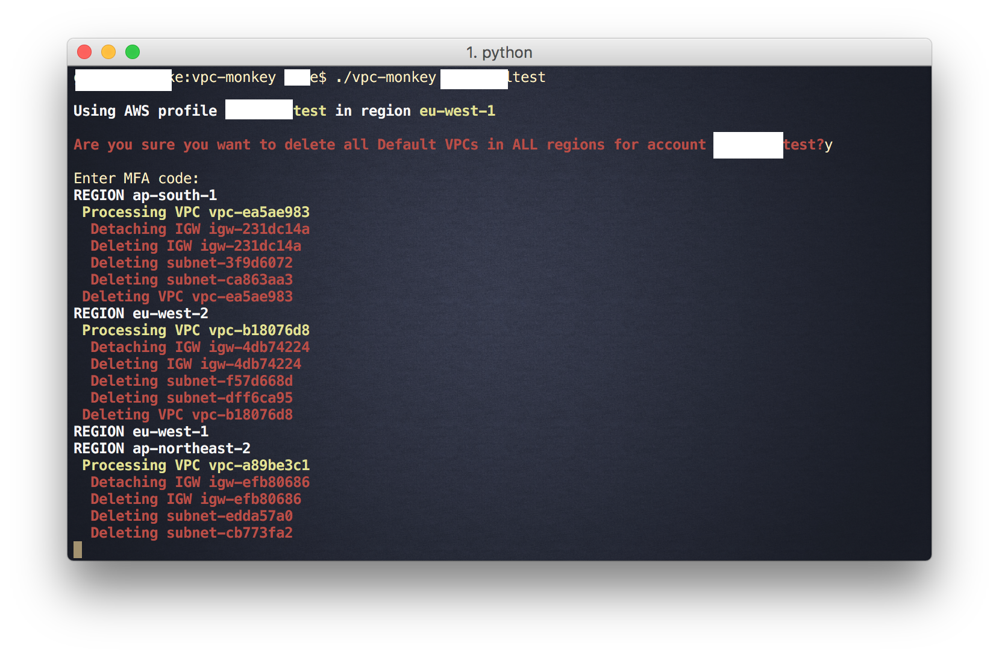

#VPC Monkey
This script simply runs through all regions and destroys your default VPCs. 

##DISCLAIMER
***USE AT YOUR OWN PERIL!*** If you don't know what you're doing, just don't.

##Requirements
- AWS CLI
- Bash (tested only on Mac, but should work in Linux)

##Files
- `README.md` - this file
- `vpc-monkey` - bash script to execute the VPC cleanup
- `_setAWSenv.sh` - sets the `AWS_DEFAULT_*` AWS CLI variables
- `vpc-monkey_global` - launch `vpc-monkey` for all accounts specified in `aws_accounts.txt`
- `aws_accounts.txt` - list account aliases and numbers

##Usage
### Per individual profile
`./vpc-monkey [profile_name]`

`[profile_name]` as per `~/.aws/config`, e.g.

### For all AWS accounts
see `aws_accounts.txt` (make sure this file is up to date)

`./vpc-monkey_global`
